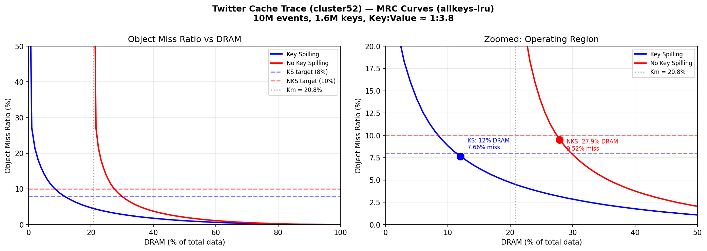

# Data Tiering Cost Savings: Key Spilling vs. No Key Spilling (allkeys-lru)

## Executive Summary

Data tiering allows Valkey to store infrequently accessed data on SSD instead of DRAM, reducing memory costs. **Key spilling** is an enhancement that also allows cold *keys* (not just values) to be moved to SSD, freeing even more DRAM.

This report quantifies the additional cost savings from key spilling across representative workloads and 3 key-to-value size ratios, using a **10:1 DRAM-to-SSD cost model**. All simulations use the **allkeys-lru** eviction policy (Valkey's default).

**Bottom line:** Key spilling reduces total spend by **$2–$43 per $100 of baseline DRAM** compared to non-key-spilling tiering, depending on key:value ratio and workload. The benefit grows as keys become larger relative to values.

---

## How Data Tiering Works

Without tiering, all data lives in DRAM. With tiering:

- **Hot data** (frequently accessed) stays in DRAM for fast access
- **Cold data** (rarely accessed) moves to SSD, which is 10× cheaper

The key question is: *how much data can you move to SSD without significantly impacting hit rates?*

### The Key Memory Problem

With Valkey data tiering (without key spilling), **all keys must remain in DRAM** even when their values are moved to SSD. Valkey needs keys in memory to route lookups. The minimum DRAM required is:

```
Minimum DRAM = Sum of all key sizes (Km)
```

This creates a "dead zone" — DRAM that can never be reclaimed regardless of access patterns:

| Key:Value Ratio | Keys as % of Total Data (Km) | Dead Zone |
|-----------------|------------------------------|-----------|
| 1:4 (small keys, large values) | 20% | 20% of DRAM can never be freed |
| 1:2 (medium keys) | 33% | 33% of DRAM can never be freed |
| 1:1 (keys = values) | 50% | 50% of DRAM can never be freed |

**Key spilling eliminates this dead zone** by allowing cold keys to move to SSD alongside their values.

---

## Understanding Workload Patterns

Data tiering (with or without key spilling) requires workloads with access skew — a "hot" subset of keys that can stay in DRAM while "cold" keys move to SSD. The following chart shows the access frequency distribution for each workload:


**How to read these charts:** A steep curve means a small number of keys handle most traffic (great for tiering). A flat line means all keys are accessed equally (tiering can't help regardless of key spilling).

- **Top row** (Zipfian, Hot Core): Top 1% of keys handle 65%+ of all traffic → strong hot/cold separation
- **Middle row** (Rotating Hot Sets, Hot Set + Scans): Moderate skew with temporal shifts
- **Bottom row** (Uniform, Sequential): Flat — data tiering provides limited savings with or without key spilling

> **Why do Rotating Hot Sets and Uniform Random look similar but perform differently?** Both show a flat rank-frequency curve, but Rotating Hot Sets has *temporal locality* — at any given moment only one hot set is active, so a DRAM cache sized to one phase captures most hits. Uniform Random has no temporal structure; every key is equally likely at every instant, so no cache size helps more than any other.

> **Note:** Access skew is a prerequisite for *any* data tiering to be effective. Both key-spilling and non-key-spilling benefit equally from skewed access patterns. The key-spilling decision is independent of access pattern — it depends on **key:value size ratio** and **SSD overhead tolerance**.

---

## Cost Model

For every **$100 of baseline DRAM spend** (no tiering):

- With tiering, you move cold data to SSD (10× cheaper per byte)
- New cost = (% kept in DRAM) + (% moved to SSD) × $0.10 per %
- **Total spend** = DRAM portion + SSD portion

**Example:** If you can keep only 30% of data in DRAM:
- Total spend = $30 (DRAM) + 70 × $0.10 (SSD) = **$37 per $100 baseline**

### SSD Overhead Adjustment

Key spilling introduces ~20% more overhead in the storage layer (keys must be fetched from SSD on cold access). To maintain equivalent end-user performance:
- **Non-key-spilling** target: ≤10% miss ratio
- **Key-spilling** target: ≤8% miss ratio (stricter to compensate for higher per-miss cost)

All results below use these asymmetric targets.

---

## Results by Workload

### Workloads That STRONGLY Benefit from Key Spilling

#### 1. Zipfian Hot Set (power-law popularity — most common in production)

A small number of keys receive the vast majority of requests (follows Zipf's law). This is the most common real-world pattern (social media feeds, product catalogs, session stores).

| Key:Value Ratio | Total Spend w/ Key Spilling | Total Spend w/o Key Spilling | **Additional Savings** |
|---|---|---|---|
| **1:4** | $30.70/100 | $40.20/100 | **$9.50/100** |
| **1:2** | $29.80/100 | $50.20/100 | **$20.40/100** |
| **1:1** | $29.80/100 | $62.60/100 | **$32.80/100** |

#### 2. Hot Core with Noisy Tail (concentrated hot set + long tail of rare keys)

A small core of ~10K keys gets 70% of traffic, with a long tail of millions of rarely-accessed keys. Common in recommendation engines, user profile caches.

| Key:Value Ratio | Total Spend w/ Key Spilling | Total Spend w/o Key Spilling | **Additional Savings** |
|---|---|---|---|
| **1:4** | $64.90/100 | $66.90/100 | **$2.00/100** |
| **1:2** | $13.60/100 | $41.80/100 | **$28.20/100** |
| **1:1** | $13.60/100 | $56.40/100 | **$42.80/100** |

---

### Workloads That MODERATELY Benefit from Key Spilling

#### 3. Rotating Hot Sets (hot set changes every N minutes)

Multiple distinct hot sets that rotate over time. Common in time-series dashboards, shift-based workloads.

| Key:Value Ratio | Total Spend w/ Key Spilling | Total Spend w/o Key Spilling | **Additional Savings** |
|---|---|---|---|
| **1:4** | $64.00/100 | $69.00/100 | **$5.00/100** |
| **1:2** | $80.20/100 | $82.60/100 | **$2.40/100** |
| **1:1** | $80.20/100 | $86.90/100 | **$6.80/100** |

#### 4. Hot Set + Periodic Scans (stable hot set with background sequential scans)

A Zipfian hot set of ~20K keys handles most traffic, but periodic sequential scans sweep through cold keys. Common in caches with background maintenance jobs, analytics pipelines.

| Key:Value Ratio | Total Spend w/ Key Spilling | Total Spend w/o Key Spilling | **Additional Savings** |
|---|---|---|---|
| **1:4** | $80.20/100 | $82.70/100 | **$2.50/100** |
| **1:2** | $79.30/100 | $85.60/100 | **$6.30/100** |
| **1:1** | $79.30/100 | $89.20/100 | **$9.90/100** |

*At 1:4 ratio, key spilling provides minimal benefit because the dead zone is small. At higher ratios, the dead zone elimination dominates.*

---

## Dollar Impact at Scale

For a Zipfian workload (most common production pattern):

| Monthly DRAM Spend (Baseline) | Total Spend (No Key Spilling, 1:4) | Total Spend (Key Spilling, 1:4) | Total Spend (No Key Spilling, 1:2) | Total Spend (Key Spilling, 1:2) |
|---|---|---|---|---|
| $10,000 | $4,020 | $3,070 | $5,020 | $2,980 |
| $100,000 | $40,200 | $30,700 | $50,200 | $29,800 |
| $1,000,000 | $402,000 | $307,000 | $502,000 | $298,000 |

---

## Summary: When Does Key Spilling Matter?

| Factor | More Benefit | Less Benefit |
|--------|-------------|--------------|
| **Key:Value ratio** | Larger keys (1:1, 1:2) | Small keys (1:4) |
| **Miss ratio tolerance** | Can absorb 20% SSD overhead | Latency-critical (every miss counts) |

### Key Insight

The value of key spilling is proportional to **Km** (keys as % of total data):
- If keys are a small fraction of total data (1:4 ratio, Km=20%), the dead zone is small and key spilling adds **$2–$9.50 per $100**
- If keys are a large fraction (1:1 ratio, Km=50%), the dead zone is massive and key spilling adds **$6.80–$42.80 per $100**

---

## Recommendation

Key spilling should be prioritized for customers with:
1. **Large key-to-value ratios** (keys > 25% of total data)
2. **Tolerance for SSD overhead** (~20% higher per-miss latency from fetching keys from SSD)

For the common case of medium keys (1:2 ratio) and Zipfian access, key spilling reduces total spend from **$50.20 to $29.80 per $100 baseline** — a **41% reduction** in the already-tiered cost.

---

## Production Use-Case: Twitter Cache Trace

The synthetic workloads above validate the model, but real production workloads have messier distributions. We replayed a **10M-event Twitter cache trace** (cluster52) through Valkey with `MONITOR TRACE FORMAT CSV` to capture true per-key memory overhead — no manual overhead estimation needed.

### Trace Profile

| Metric | Value |
|--------|-------|
| Unique keys | 1,615,514 |
| Total accesses | 10,000,000 |
| Total key bytes (with overhead) | 88.1 MB (20.8%) |
| Total value bytes | 335.7 MB (79.2%) |
| Total working set | 423.8 MB |
| Key:Value ratio | ~1:3.8 (between 1:4 and 1:2) |
| Avg key size (incl. robj + SDS) | 54.5 bytes |
| Avg value size | 207.8 bytes |

### MRC Results (allkeys-lru)

A **Miss Ratio Curve (MRC)** shows how miss ratio decreases as you allocate more DRAM. The two curves differ because they measure DRAM differently: the key-spilling curve starts at 0% DRAM (all data on SSD, including keys), while the no-key-spilling curve starts at Km (20.8%) because keys must always reside in DRAM. This gap between the curves *is* the dead zone — DRAM that no-key-spilling can never reclaim.



| Mode | Target | DRAM Needed | % of Total | Actual Miss |
|------|--------|-------------|------------|-------------|
| **Key Spilling** | ≤8% | 50.9 MB | 12.0% | 7.66% |
| **No Key Spilling** | ≤10% | 118.3 MB | 27.9% | 9.52% |

Key spilling needs **12% DRAM** vs **28% DRAM** for non-key-spilling — a 2.3× reduction in DRAM requirement.

### Dollar Impact

| | Key Spilling | No Key Spilling | Δ |
|---|---|---|---|
| DRAM cost (per $100 baseline) | $12.00 | $27.90 | |
| SSD cost (at 10:1 DRAM:SSD ratio) | $8.80 | $7.21 | |
| **Total tiered cost** | **$20.80** | **$35.11** | **$14.31 savings** |
| **Reduction vs all-DRAM** | 79% | 65% | +14pp |

### Interpretation

The Twitter trace has a natural key:value ratio of ~1:3.8, placing it between our 1:4 and 1:2 synthetic scenarios. The result ($14.31 additional savings per $100) aligns with the synthetic predictions:
- 1:4 synthetic (Zipfian): $9.50 savings
- 1:2 synthetic (Zipfian): $20.40 savings
- **Twitter real trace (1:3.8): $14.31 savings** ← falls between, as expected

The trace exhibits strong Zipfian-like access skew: only 12% of data in DRAM captures 92% of requests. This confirms that production Twitter-style caching workloads are excellent candidates for key spilling, delivering **$143,100 in additional annual savings per $1M of baseline DRAM spend**.

---

## Methodology

- **Simulator**: Custom MRC (Miss Ratio Curve) simulator using allkeys-lru eviction policy (matches Valkey's default)
- **Synthetic workloads**: 6 traces with 1M events each, 1M unique keys
- **Production trace**: Twitter cluster52 (10M events, 1.6M keys) captured via `MONITOR TRACE FORMAT CSV` with true memory overhead
- **Capacity sweep**: 101 points from 0% to 100% of total data size
- **Cost model**: 10:1 DRAM:SSD cost ratio ($1/unit DRAM, $0.10/unit SSD)
- **Miss ratio targets**: 8% for key-spilling, 10% for non-key-spilling (accounts for ~20% SSD overhead with key spilling)
- **Key:Value ratios tested**: 1:4 (Km=20%), 1:2 (Km=33%), 1:1 (Km=50%), plus real-world 1:3.8 (Twitter)
