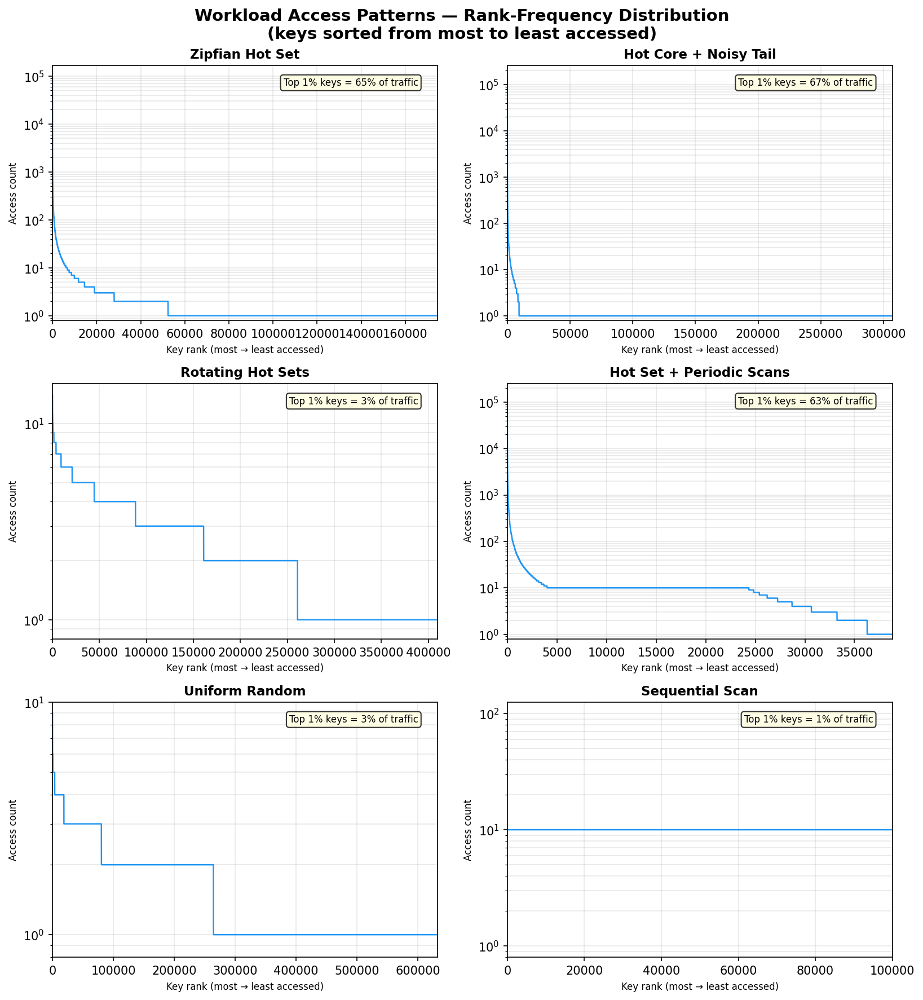
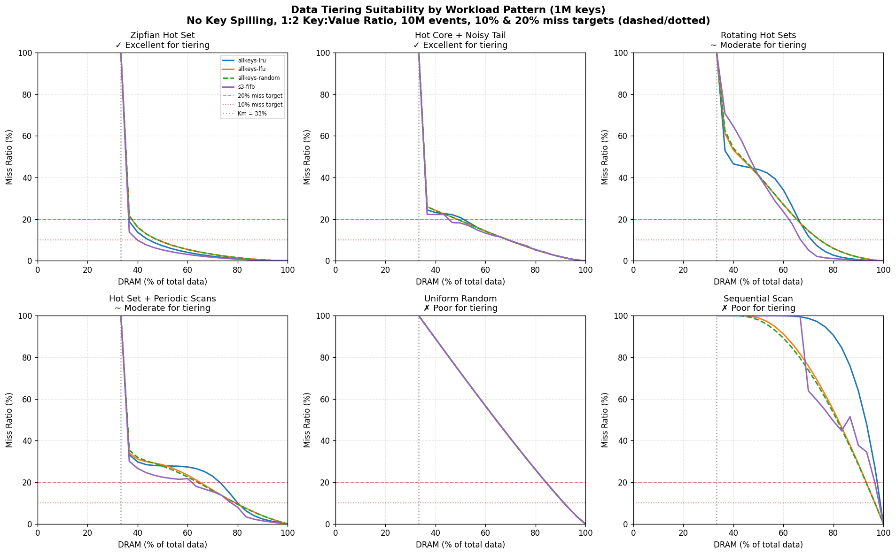
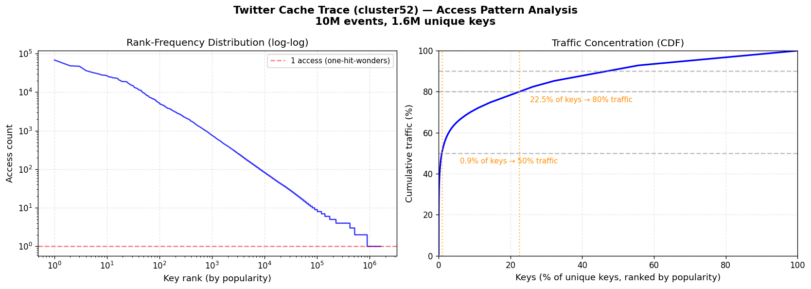
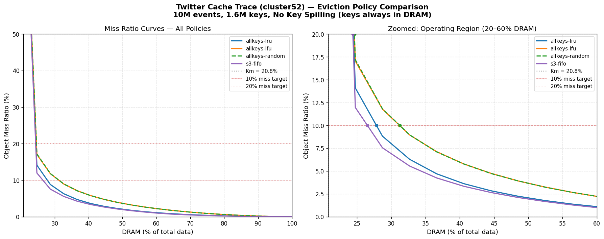

# Data Tiering Workload Analysis

## Executive Summary

Data tiering moves cold data from DRAM to SSD, reducing memory costs by 10×. But not all workloads benefit equally — tiering requires **access skew** (a hot subset of keys that can stay in DRAM while cold keys move to SSD).

This report evaluates six representative workload patterns and one production trace across 4 eviction policies, using a **1:2 key-to-value size ratio** and a **10:1 DRAM-to-SSD cost model**, to determine when data tiering is effective, which eviction policies perform best, and how much DRAM can be saved.

### Simulation Parameters

| Parameter | Value | Notes |
|-----------|-------|-------|
| **Key:Value size ratio** | 1:2 | Conservative — larger values (1:4, 1:10) benefit *more* from tiering since a larger fraction of data is evictable. We deliberately chose a small ratio to show minimum expected savings. |
| **Cost model** | 10:1 DRAM:SSD | $1/unit DRAM vs $0.10/unit SSD — representative of cloud instance pricing (e.g., r6g vs i3/d3 storage-optimized) |
| **Eviction policies** | allkeys-lru, allkeys-lfu, allkeys-random, S3-FIFO | The `allkeys-*` policies are Valkey's built-in eviction policies (sampled with 5 candidates). **S3-FIFO** is included as an example of a possible future policy — it is not currently available in Valkey but demonstrates the potential of scan-resistant admission filters. |
| **Trace length** | 10M events | Sufficient for steady-state convergence |
| **Unique keys** | 1M (synthetic), 1.6M (Twitter) | |

**Key findings:**
- Workloads with strong access skew (Zipfian, hot core) can reduce DRAM to **36–51% of total data** at a 20% miss ratio target, or **40–69%** at a stricter 10% target
- Workloads without skew (uniform, sequential) see **minimal benefit** — they need 84–97% DRAM regardless of policy
- **S3-FIFO** and **allkeys-lru** are the best general-purpose policies
- A production Twitter cache trace achieves **<10% miss at just 28% DRAM** — confirming that real-world caching workloads are excellent tiering candidates
- With a larger key:value ratio (e.g., 1:4), savings would be even greater since Km drops from 33% to 20%, making more data evictable

> **Note on miss ratio targets**: The 10% and 20% miss ratio targets used throughout this document are estimates. The actual acceptable miss ratio for a deployment is a function of (1) the throughput of the workload (ops/sec), (2) the latency characteristics of the storage/tiering layer (SSD read latency, queue depth), and (3) the application's tail latency budget. A workload doing 10K ops/s with a 1ms SSD read may tolerate 20% misses, while a workload doing 500K ops/s with the same SSD would need ≤5% misses to avoid saturating the storage layer.

---

## The Memory Cost Problem

Valkey stores all data in DRAM. For large datasets, DRAM dominates infrastructure cost. Data tiering addresses this by partitioning data into tiers:

- **Hot tier (DRAM)**: Frequently accessed keys — fast, expensive
- **Cold tier (SSD)**: Rarely accessed keys — slow, 10× cheaper

The fundamental question: *how much data can move to SSD without unacceptable performance impact?*

### The Key Metadata Floor (Km)

Without key spilling, all key metadata must remain in DRAM for routing lookups. This creates an irreducible minimum:

```
Minimum DRAM = Sum of all key entry sizes (Km)
```

| Key:Value Ratio | Km (% of total data) | Implication |
|-----------------|---------------------|-------------|
| 1:4 (small keys) | 20% | 80% of data is evictable |
| 1:2 (medium keys) | 33% | 67% of data is evictable |
| 1:1 (large keys) | 50% | Only 50% of data is evictable |

The evictable portion is `100% - Km`. Tiering can only save money on this portion.

---

## Workload Patterns

Data tiering effectiveness depends entirely on the workload's access pattern. We evaluate six representative patterns that span the spectrum from "ideal for tiering" to "tiering cannot help."



### Understanding Access Skew

**Access skew** means some keys are accessed far more often than others. A workload with high skew has a clear hot/cold separation — perfect for tiering. A workload with no skew (uniform) means every key is equally likely to be accessed next — no subset can be safely moved to SSD.

### Temporal Locality and Working Set Drift

Beyond static popularity, real workloads have **temporal structure**:

- **Stable hot set**: The same keys are popular throughout the trace. LRU and LFU learn the hot set quickly and keep it cached. *Best case for tiering.*
- **Rotating hot sets**: Popularity shifts over time (e.g., time-of-day effects). The cache must adapt to new hot sets while evicting old ones. *Moderate — tiering works if the hot set at any moment fits in DRAM.*
- **Scans**: Periodic sequential sweeps through cold data pollute the cache by promoting cold keys. *Challenging — scan-resistant policies (S3-FIFO) help.*
- **No locality**: Every access is independent of history (uniform random). *Worst case — no policy can help.*

**Working set drift** refers to how the hot set changes over time. A workload with slow drift (e.g., trending topics that shift hourly) gives the eviction policy time to adapt. Rapid drift (e.g., rotating hot sets every few seconds) causes burst misses during transitions as the cache warms up the new hot set.

---

## The Six Workloads

| # | Workload | Description | Access Pattern | How Generated |
|---|----------|-------------|----------------|---------------|
| 1 | **Zipfian Hot Set** | Power-law popularity (α≈1.05) | Stable, highly skewed — top 1% gets 50%+ traffic | Finite Zipf distribution over 1M keys with α=1.05; each access samples from the static rank-frequency distribution |
| 2 | **Hot Core + Noisy Tail** | 10K hot keys (70% traffic) + sequential tail | Bimodal — clear hot/cold boundary | 70% of accesses draw from Zipf(α=1.2) over 10K keys; 30% scan sequentially through remaining 990K keys |
| 3 | **Rotating Hot Sets** | 8 hot sets that rotate every 1M ops | Temporal drift — hot set changes periodically | 8 disjoint 50K-key regions; 90% of accesses hit the current phase's region, 10% random; phase rotates every 1M events |
| 4 | **Hot Set + Periodic Scans** | Zipfian base + sequential scan every 100K ops | Scan pollution — cold keys periodically promoted | 80% Zipf(α=1.15) over 20K hot keys; 20% sequential scan through keys 200K+ in 20K-event bursts every 100K events |
| 5 | **Uniform Random** | All keys equally likely | No skew — worst case for tiering | Each access uniformly samples from the full 1M keyspace; every key has equal probability 1/N |
| 6 | **Sequential Scan** | Keys accessed in order, cycling through 100K keys | No reuse within cache window | Accesses keys 0, 1, 2, ..., 99999, 0, 1, ... in strict order; working set equals entire keyspace at all times |

All synthetic traces use **10M events**, **1M unique keys**, and a **1:2 key:value size ratio** (Km = 33%). Value sizes follow a heavy-tailed distribution (75% small 128–1024B, 20% medium 2–16KB, 5% large 64–512KB).

---

## MRC Results by Workload

A **Miss Ratio Curve (MRC)** shows how miss ratio decreases as DRAM increases. The vertical dotted gray line marks **Km** (33%) — the minimum DRAM required for key metadata. Two target lines are shown:
- **20% miss ratio** (dashed red) — conservative target suitable for low-throughput workloads or fast storage layers
- **10% miss ratio** (dotted red) — stricter target for high-throughput workloads where storage layer saturation is a concern

> These targets are estimates. The actual acceptable miss ratio depends on workload throughput and storage layer performance. See the executive summary note for guidance.



### DRAM Required at Target Miss Ratios

| Workload | Target | allkeys-lru | allkeys-lfu | allkeys-random | s3-fifo | Verdict |
|----------|--------|-------------|-------------|----------------|---------|---------|
| **Zipfian Hot Set** | 20% | 36.6% | 37.6% | 37.7% | 36.4% | ✓ Excellent |
| | 10% | 44.6% | 48.2% | 48.2% | 39.9% | |
| **Hot Core + Tail** | 20% | 51.0% | 48.5% | 48.5% | 45.2% | ✓ Excellent |
| | 10% | 69.0% | 69.0% | 68.9% | 69.2% | |
| **Rotating Hot Sets** | 20% | 66.0% | 65.3% | 65.3% | 62.1% | ~ Moderate |
| | 10% | 71.3% | 74.6% | 74.6% | 66.9% | |
| **Hot Set + Scans** | 20% | 72.8% | 64.9% | 63.9% | 61.6% | ~ Moderate |
| | 10% | 80.0% | 79.2% | 79.1% | 77.5% | |
| **Uniform Random** | 20% | 84.2% | 84.2% | 84.1% | 84.2% | ✗ Poor |
| | 10% | 91.4% | 91.4% | 91.4% | 91.4% | |
| **Sequential Scan** | 20% | 97.5% | 93.1% | 93.1% | 96.5% | ✗ Poor |
| | 10% | 98.8% | 96.6% | 96.6% | 98.3% | |

*All values are % of total data that must remain in DRAM. Lower = more savings. Key:Value ratio = 1:2 (Km = 33%).*

---

## Workload-by-Workload Analysis

### ✓ Excellent: Zipfian Hot Set

**Pattern**: Power-law popularity — a few keys dominate traffic (social media feeds, product catalogs, session stores).

**Why tiering works**: The top ~5% of keys handle 65%+ of traffic. A small DRAM cache captures most hits. The remaining 95% of keys can live on SSD with minimal miss impact.

**Best policy**: S3-FIFO (36.4% at 20%, 39.9% at 10%) — its admission filter prevents one-hit-wonders from polluting the main cache. allkeys-lru (36.6%/44.6%) is a close second.

**DRAM savings at 20% target**: 63% of data moves to SSD.
**DRAM savings at 10% target**: 55–60% of data moves to SSD (policy-dependent).

---

### ✓ Excellent: Hot Core + Noisy Tail

**Pattern**: A small core of ~10K keys gets 70% of traffic, with a long tail of 960K rarely-accessed keys (recommendation engines, user profile caches).

**Why tiering works**: The hot core is tiny and stable — it fits easily in a small DRAM allocation. The long tail is almost never accessed and can be entirely on SSD.

**Best policy**: S3-FIFO (45.2% at 20%) — filters tail accesses effectively. At the stricter 10% target, all policies converge (~69%) because the tail's sequential scan pattern requires more DRAM to absorb.

**DRAM savings at 20% target**: 49–55% of data moves to SSD.
**DRAM savings at 10% target**: ~31% of data moves to SSD — still meaningful but the gap between targets is large, indicating sensitivity to the tail scan pattern.

---

### ~ Moderate: Rotating Hot Sets

**Pattern**: Multiple distinct hot sets that rotate over time (time-series dashboards, shift-based workloads, trending topics).

**Why tiering partially works**: At any given moment, only one hot set is active and fits in DRAM. But when the hot set rotates, the cache must flush old entries and warm up new ones — causing burst misses during transitions.

**Best policy**: S3-FIFO (62.1% at 20%, 66.9% at 10%) handles rotation well. allkeys-lru (66.0%/71.3%) adapts quickly to new hot sets via recency.

**DRAM savings at 20% target**: 34–38% of data moves to SSD.
**DRAM savings at 10% target**: 25–33% of data moves to SSD — marginal benefit.

---

### ~ Moderate: Hot Set + Periodic Scans

**Pattern**: A stable Zipfian hot set with periodic background sequential scans (caches with maintenance jobs, analytics pipelines).

**Why tiering partially works**: The base workload is excellent for tiering, but periodic scans pollute the cache by promoting cold keys, temporarily evicting hot ones.

**Best policy**: S3-FIFO (61.6% at 20%, 77.5% at 10%) — its small queue filters scan keys before they enter the main cache. allkeys-random (63.9%/79.1%) also resists scan pollution because eviction is independent of access order.

**DRAM savings at 20% target**: 27–38% of data moves to SSD (highly policy-dependent).
**DRAM savings at 10% target**: 20–23% of data moves to SSD — scan resistance is critical.

---

### ✗ Poor: Uniform Random

**Pattern**: All keys equally likely at every instant (hash-based load balancing, random sampling workloads).

**Why tiering fails**: No hot/cold separation exists. Every key has the same probability of being accessed next. Moving any subset to SSD guarantees proportional misses — there's no "safe" cold set.

**All policies**: ~84% DRAM at 20% target, ~91% at 10% target. No policy can outperform another because there's no pattern to exploit.

**DRAM savings**: Minimal — only 16% moves to SSD at 20% target, and the miss ratio is still at the target threshold.

---

### ✗ Poor: Sequential Scan

**Pattern**: Keys accessed in strict order, cycling through the entire keyspace (log replay, data migration, full-table scans).

**Why tiering fails**: Every key is accessed exactly once per cycle. The working set at any moment equals the entire dataset. No subset is "cold" — every key will be needed again soon.

**All policies**: 93–98% DRAM at 20% target, 97–99% at 10% target. LRU needs ~98% because it evicts the oldest entry, which is exactly the next one needed (Bélády's anomaly).

**DRAM savings**: Essentially none. Sequential scans should bypass the cache entirely.

---

## Policy Recommendations

| Workload Type | Best Policy | Why |
|---------------|-------------|-----|
| Zipfian / power-law | **S3-FIFO** or **allkeys-lru** | Admission filter + recency track popularity well |
| Bimodal (hot core + tail) | **S3-FIFO** | Filters tail noise; all policies similar at strict targets |
| Rotating / temporal drift | **S3-FIFO** or **allkeys-lru** | Fast adaptation to new hot sets |
| Scan-heavy | **S3-FIFO** | Scan-resistant admission filter |
| Uniform / sequential | None helps | Consider not using tiering |

**Default recommendation**: `allkeys-lru` — it's Valkey's default, performs well across all tiering-friendly workloads, and has no pathological cases. S3-FIFO is theoretically superior but not currently available in Valkey.

---

## Production Example: Twitter Cache Trace

The synthetic workloads above validate the model. To confirm with real production data, we analyze a **10M-event Twitter cache trace** (cluster52).

### Trace Profile

| Metric | Value |
|--------|-------|
| Source | Twitter cluster52 (production cache) |
| Total accesses | 10,000,000 |
| Unique keys | 1,615,514 |
| Key:Value ratio | ~1:3.8 |
| Key metadata floor (Km) | 20.8% |
| One-hit-wonders | 44.5% of keys (7.2% of traffic) |
| Top 1% keys | 51.1% of traffic |
| Top 10% keys | 71.2% of traffic |

### Access Distribution



The rank-frequency plot confirms Zipfian-like behavior: a near-linear relationship on log-log axes. The CDF shows extreme concentration — less than 1% of keys handle 50% of all traffic.

### MRC Results (All Policies)



### DRAM Savings at Target Miss Ratios

| Policy | DRAM at 10% Miss | DRAM at 20% Miss | Savings vs All-DRAM (10%) | Savings vs All-DRAM (20%) |
|--------|-----------------|-----------------|---------------------------|---------------------------|
| **s3-fifo** | 26.5% | 24.4% | 73.5% | 75.6% |
| **allkeys-lru** | 27.8% | 24.5% | 72.2% | 75.5% |
| **allkeys-lfu** | 31.2% | 24.6% | 68.8% | 75.4% |
| **allkeys-random** | 31.2% | 24.6% | 68.8% | 75.4% |

The Twitter trace is so heavily skewed that a 20% miss target is achieved almost immediately above the key metadata floor — all policies converge. The policies differentiate at the stricter 10% target, where S3-FIFO and LRU show clear advantages.

> **Interpreting these targets**: At 10% miss with 100K ops/s throughput, the storage layer would need to sustain 10K random reads/sec. A modern NVMe SSD can handle this comfortably (>100K IOPS). At 500K ops/s, the same 10% miss means 50K storage reads/sec — still within NVMe capability but approaching saturation. The right target depends on your deployment's throughput and SSD specs.

### Cost Impact

Using allkeys-lru at a 10% miss target:

| | Value |
|---|---|
| DRAM needed | 27.8% of total data (117.8 MB) |
| Data on SSD | 72.2% (305.9 MB) |
| Requests served from DRAM | 90% |
| **Cost per $100 baseline** | **$35.02** |
| **Savings vs all-DRAM** | **$64.98 (65%)** |

### At Scale

| Monthly DRAM Baseline | Tiered Cost (10% miss) | Annual Savings |
|----------------------|------------------------|----------------|
| $10,000 | $3,502 | $77,976 |
| $100,000 | $35,020 | $779,760 |
| $1,000,000 | $350,200 | $7,797,600 |

---

## Summary: When to Use Data Tiering

This report quantifies DRAM savings from data tiering across representative workloads using a **1:2 key-to-value size ratio** (conservative), a **10:1 DRAM-to-SSD cost model**, and 4 eviction policies: Valkey's built-in `allkeys-lru`, `allkeys-lfu`, `allkeys-random`, plus `S3-FIFO` as a candidate future policy.

| Factor | Tiering Effective | Tiering Ineffective |
|--------|-------------------|---------------------|
| **Access pattern** | Zipfian, bimodal, hot core | Uniform, sequential |
| **Traffic concentration** | Top 10% keys > 50% traffic | All keys ~equal traffic |
| **One-hit-wonders** | High % (cold data to offload) | Low % (all data is hot) |
| **Working set stability** | Stable or slowly drifting | Rapidly cycling |
| **Read/write ratio** | Read-heavy | Write-heavy (SSD wear) |
| **Latency tolerance** | Can absorb 10–20% SSD misses | Sub-ms P99 required |

**The majority of production caching workloads exhibit Zipfian-like access patterns** — making data tiering broadly applicable. The Twitter trace confirms this: a real production cache achieves 65% cost reduction with only 10% of requests touching SSD.

---

## Methodology

- **Synthetic traces**: 6 workloads × 10M events × 1M unique keys, 1:2 key:value ratio (conservative — larger ratios benefit more)
- **Production trace**: Twitter cluster52, 10M events, 1.6M keys, captured via `MONITOR TRACE FORMAT CSV`
- **Simulator**: Custom Rust MRC simulator with sampled eviction policies matching Valkey's implementation
- **Policies tested**:
  - `allkeys-lru` — Valkey's default; sampled LRU with 5 candidates per eviction
  - `allkeys-lfu` — sampled LFU with 5 candidates, logarithmic counter with decay factor 10
  - `allkeys-random` — random eviction with 5 candidates
  - `S3-FIFO` — experimental scan-resistant policy (small queue=10%, ghost queue=90%); not currently in Valkey, included to demonstrate potential of admission-filtered designs
- **Capacity sweep**: 21 points from Km to 100% of total data
- **Miss measurement**: Object miss ratio, excluding compulsory (first-touch) misses
- **Miss ratio targets**: 10% and 20% — these are estimates; actual acceptable miss ratios depend on workload throughput (ops/sec) and storage layer performance (IOPS, latency). Higher throughput or slower storage requires stricter (lower) miss targets.
- **Cost model**: 10:1 DRAM:SSD cost ratio ($1/unit DRAM, $0.10/unit SSD) — representative of cloud pricing for memory-optimized vs storage-optimized instances

### References

1. Yang et al., "FIFO queues are all you need for cache eviction" (SOSP 2023) — S3-FIFO algorithm
2. Berger et al., "Practical Bounds on Optimal Caching with Variable Object Sizes" (SIGMETRICS 2018) — MRC theory
3. Twitter cache trace dataset (cluster52) — production workload validation
4. Valkey source code — eviction policy implementation details (sampled LRU/LFU with 5 candidates)
